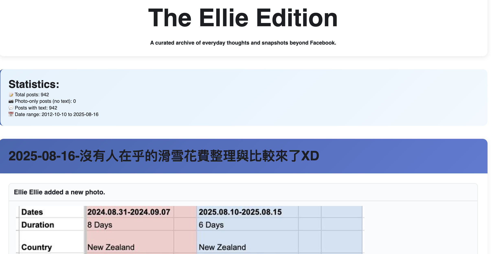

# Facebook Export to Blog Converter

*[This is a vibe coding project with limited verification - use at your own risk.🤖]*

Convert Facebook HTML export into a clean, easy-to-read blog website. This tool keeps your important posts (status updates and photos) and organises them by date, with a modern look.

##### Example Output



## What does this do?

- Keeps only posts and photos (ignores likes, shares, etc.)
- Removes Facebook clutter ("Timeline photos", "Mobile uploads", etc.)
- Lets you set your name so only your posts are included
- Makes your blog look good on phones, tablets, and computers
- Shows your posts from newest to oldest
- Fixes image links automatically
- Makes blog titles that are easy to read and search
- Keeps Facebook's original style for familiar look

---

## Quick Start Guide

### What you need

- A computer (Windows, Mac, or Linux)
- [Python 3](https://www.python.org/downloads/) (free, easy to install)
- A code editor like [VS Code](https://code.visualstudio.com/)(free, easy to install)

---

### Step 1: Download your Facebook data

1. Go to Facebook → **Settings** → **Your Facebook Information** → **Download Your Information**
2. Select **"Posts"** only, and choose **HTML format**
3. Click **Create File** and wait for Facebook to finish
4. Download and unzip (extract) the file to your computer

---

### Step 2: Prepare your files

1. Find the file named something like `your_posts__check_ins__photos_and_videos_1.html` in your Facebook download
2. Copy this file into the folder: `processing/input/`
3. Copy the entire `media/` folder (with your photos) into `processing/input/media/`

*Tip: If you can't find these folders, create them inside the project folder.*

---

### Step 3: Tell the tool your Facebook name

1. In VS Code, open the file: `processing/scripts/config.py`
2. Find the line that says `FACEBOOK_USERNAME = ""`
3. Type your Facebook display name between the quotes, for example:
   ```
   FACEBOOK_USERNAME = "Jane Smith"
   ```
4. (Optional) You can change other settings in this file.

---

### Step 4: Run the converter

1. Open a **Terminal** (Mac/Linux) or **Command Prompt** (Windows)
2. Go to your project folder. For example:
   ```
   cd path/to/fb-export-to-blog
   ```
3. Install the needed tools (only once):
   ```
   pip3 install -r requirements.txt
   ```
4. Run the converter:
   ```
   python3 processing/scripts/create_fb_posts.py
   ```

---

### Step 5: See your blog!

- Open the file in `processing/output/` that looks like `fb-posts-YYYYMMDD-HHMMSS.html`
- Double-click to open it in your web browser

---

## Troubleshooting

- **Python not found?**  
  Download and install Python 3 from [python.org](https://www.python.org/downloads/). Restart your computer if needed.

- **pip3 not found?**  
  Try `pip` instead of `pip3`. Or install pip by following [these instructions](https://pip.pypa.io/en/stable/installation/).

- **Can't find folders?**  
  Make sure you are in the correct project folder. Create missing folders if needed.

- **No posts appear?**  
  Double-check your `FACEBOOK_USERNAME` in `config.py` matches your Facebook display name exactly.

---

## File Structure

```
fb-export-to-blog/
├── requirements.txt           # Python dependencies
├── README.md                 # This file
├── original/                 # Facebook export archive
│   └── your_facebook_activity/
├── processing/
│   ├── input/                # Your Facebook files go here
│   │   ├── your_posts__*.html
│   │   └── media/
│   ├── output/               # Generated blog
│   │   └── fb-posts-YYYYMMDD-HHMMSS.html
│   └── scripts/              # Converter tools
│       ├── config.py             # ⚙️ Configuration file  
│       ├── create_fb_posts.py    # 🌟 Main converter
│       ├── analyze_file.py       # Analyze content
│       ├── count_unique.py       # Post statistics
│       ├── debug_extract.py      # Debug tool
│       ├── extract_final.py      # Filter posts
│       ├── extract_posts.py      # Basic extraction
│       └── fix_image_paths.py    # Fix image links
```

---

## What are the scripts for?
- `config.py` - Change settings (your name, options)
- `create_fb_posts.py` - The main tool (run this!)
- `analyze_file.py` - See what types of posts you have
- `count_unique.py` - Count your post types
- `debug_extract.py` - For fixing problems
- `extract_final.py` - Filters only the good posts
- `extract_posts.py` - Basic post extraction
- `fix_image_paths.py` - Fixes broken image links

---

